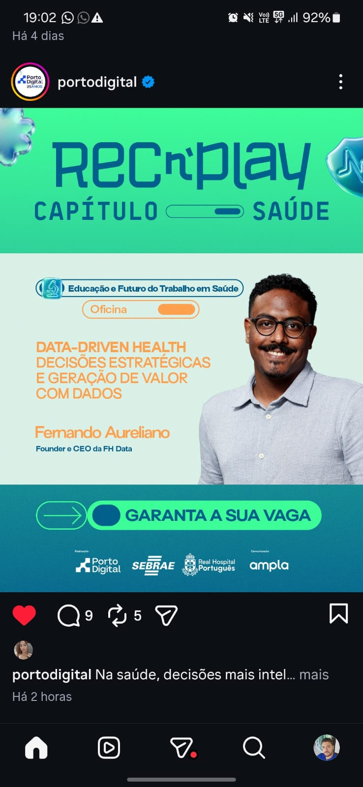

<p align="center">
  <picture>
    <source media="(prefers-color-scheme: dark)" srcset="assets/logo-keycore-dark.png">
    <source media="(prefers-color-scheme: light)" srcset="assets/logo-keycore-light.png">
    
  </picture>
</p>

<h1 align="center">Workshop Data-Driven Health • REC'n'Play (Porto Digital)</h1>

<p align="center">
  <strong>Decisões Estratégicas e Geração de Valor com Dados no Setor de Saúde</strong><br>
  <em>Estudo de Caso Executivo Baseado em 2.371 Cirurgias Médicas e Soluções OPME (2021-2025)</em>
</p>

<p align="center">
  <a href="https://rogerin.github.io/workshop-fhdata/" target="_blank">
    
  </a>
</p>

---

<p align="center">
  
</p>

<p align="center">
  <sub><strong>Oficina Oficial no REC'n'Play • Capítulo Saúde</strong> | Trilha: <em>Educação e Futuro do Trabalho em Saúde</em><br>
  Facilitador: <strong>Fernando Aureliano</strong> (Founder e CEO da FH Data) • Em parceria com <strong>Porto Digital</strong>, <strong>SEBRAE</strong>, <strong>Real Hospital Português</strong> e <strong>KeyCore</strong>.</sub>
</p>

---

## 🏥 Contexto do Workshop

Este repositório documenta a metodologia prática e os entregáveis de inteligência analítica apresentados durante o **REC'n'Play (Capítulo Saúde)** — promovido pelo **Porto Digital** em parceria com o **SEBRAE**, o **Real Hospital Português** e a **Ampla**.

A oficina **"Data-Driven Health: Decisões Estratégicas e Geração de Valor com Dados"**, liderada por **Fernando Aureliano** (*Founder & CEO da FH Data*) com a participação estratégica e arquitetura analítica da **[KeyCore](https://keycore.com.br)**, teve como objetivo transformar uma base operacional bruta de **2.371 procedimentos cirúrgicos de alta complexidade em OPME** em um **painel executivo de tomada de decisão multidimensional para os 5 C-Levels (CEO, CFO, COO, CHRO e CMO)**.

---

## 🌐 Dashboard no GitHub Pages

O painel executivo interativo construído com a paleta oficial da **FH Data** (Dark Obsidian, Electric Mint, Sand Cream e Coral) e arquitetura **Mobile-First** está disponível online em:

👉 **[https://rogerin.github.io/workshop-fhdata/](https://rogerin.github.io/workshop-fhdata/)**

---

## 📊 Sumário dos Dados Reais Auditados (2021 a 2025)

| Métrica Macro | Valor Consolidado | Contexto e Impacto no Negócio |
| :--- | :---: | :--- |
| **Pipeline Total Processado** | **R$ 369.251.834,00** | 2.371 oportunidades e cotações cirúrgicas analisadas |
| **Receita Bruta Ganha** | **R$ 176.300.010,00** | 1.198 cirurgias realizadas (**50,5% Win Rate**) |
| **Crescimento Histórico (CAGR)** | **+19,3% a.a.** | R$ 24,0M (2021) ➔ R$ 48,6M (2025) (**+102,5% acumulado**) |
| **Valor Perdido no Funil** | **R$ 192.951.824,00** | 1.173 cotações não convertidas nas 4 etapas |
| **Glosas Hospitalares Aplicadas** | **R$ 14.491.875,00** | 8,22% do faturamento bruto retido por operadoras e convênios |
| **Glosas Não Recuperadas (Prejuízo Real)** | **R$ 7.223.832,00** | 4,10% da receita perdida em definitivo por recursos indeferidos |
| **Receita Líquida Realizada** | **R$ 169.076.178,00** | Caixa efetivo após dedução das glosas definitivas |
| **Ciclo Operacional Médio** | **164,7 dias** | Lead time completo: Cotação ➔ Cirurgia ➔ Faturamento ➔ Pagamento |
| **Concentração Geográfica** | **76,1% em PE** | Pernambuco responde por R$ 134,2M de faturamento |
| **Concentração em Clientes** | **47,6% Top 2** | *Vitalis* (R$ 47,9M) e *Bem-Estar* (R$ 35,9M) |

---

## 🎯 As 5 Sessões Estratégicas C-Suite (Perguntas, OKRs & Pontos Cegos)

O ponto alto da oficina foi demonstrar como a **atuação em silos departamentais destrói capital de giro** e como alinhar os 5 executivos sob uma visão sistêmica integrada:

```
                                  ┌────────────────────────┐
                                  │   CEO: Meta R$ 110M    │
                                  │  (Sem Dívida/Diluição) │
                                  └───────────┬────────────┘
                                              │
                    ┌─────────────────────────┼─────────────────────────┐
                    │                         │                         │
        ┌───────────┴──────────┐  ┌───────────┴──────────┐  ┌───────────┴──────────┐
        │   CFO: Glosas & DSO  │  │  COO: SLA & Headcount│  │ CHRO: Qualidade Vendas│
        │  (Preservação Caixa) │  │ (Consignação Parada) │  │(Capital Preso Seller)│
        └───────────┬──────────┘  └───────────┬──────────┘  └───────────┬──────────┘
                    │                         │                         │
                    └─────────────────────────┼─────────────────────────┘
                                              │
                                  ┌───────────┴────────────┐
                                  │  CMO: ICP por Margem   │
                                  │  (Eficiência Capital)  │
                                  └────────────────────────┘
```

---

### 1. 👑 Sessão CEO (Chief Executive Officer)
* **Pergunta Central:** *"Qual é a meta do ano que vem e dos próximos cinco anos?"*
* **OKR:** Chegar a **R$ 110 Milhões em 5 anos (2030)** e assumir a liderança regional **sem captar dívida bancária e sem diluir a sociedade** (100% autofinanciado por geração de caixa).
  * *Curva de Faturamento:* 2025: R$ 48,6M ➔ 2026: R$ 57,2M (+17,7%) ➔ 2030: R$ 110M (+126,3%).
* **O que o OKR empurra a fazer (Vício):** Cobrar crescimento agressivo de receita de todo mundo o tempo todo ("vender a qualquer custo").
* **Onde ele erra sozinho (Ponto Cego):** Trata a restrição de capital como detalhe do CFO, quando ela é exatamente o que define a **velocidade máxima de crescimento sustentável da empresa inteira (*Self-Sustaining Growth Rate*)**.
  * *A Trava Matemática:* Com o ciclo atual de 165 dias, para faturar R$ 110M a empresa precisará de **R$ 49,6 Milhões de capital de giro imobilizado**. Sem dívida nem diluição, a empresa quebra antes de bater R$ 70M se não encurtar o ciclo operacional!

---

### 2. 👥 Sessão CHRO (Chief Human Resources Officer)
* **Pergunta Central:** *"Qual dos meus vendedores performa melhor?"*
* **OKR:** Reter os três melhores vendedores e reduzir o turnover comercial para **menos de 15% ao ano**.
* **O que o OKR empurra a fazer (Vício):** Ranquear por receita bruta faturada e premiar o topo da lista (Ricardo Aragão R$ 41,2M, Marcelo Bastos R$ 25,5M, Diego Fontes R$ 18,8M).
* **Onde ele erra sozinho (Ponto Cego):** **O ranking por receita premia exatamente quem mais consome capital da empresa e quem mais gera glosas!**
  * *Evidência dos Dados:* Ricardo Aragão lidera o faturamento (R$ 41,2M), mas opera com ciclo médio de **220,6 dias** (DSO de 158d + 62d de consignação), imobilizando **R$ 24,91 Milhões de capital de giro** e gerando **R$ 2,41 Milhões de glosas perdidas (5,8%)**.
  * *Os Verdadeiros Geradores de Caixa:* Tatiana Coelho (R$ 14,3M | ciclo 121d | 2,0% glosa) e Joana Rios (R$ 6,7M | ciclo 93d | 1,4% glosa) geram muito mais lucro líquido real por real vendido.

---

### 3. ⚙️ Sessão COO (Chief Operating Officer)
* **Pergunta Central:** *"Quantas pessoas preciso contratar nos próximos cinco anos?"*
* **OKR:** Sustentar nível de serviço **24x7** com crescimento de receita sem estourar o custo fixo.
* **O que o OKR empurra a fazer (Vício):** Dimensionar equipe pela projeção linear de demanda cirúrgica (ex: "contratar +20 vendedores, +15 instrumentadores e +8 motoristas").
* **Onde ele erra sozinho (Ponto Cego):** **Contratar vendedor sem capital de giro para bancar a consignação que ele vai gerar é contratar prejuízo e asfixia de caixa!**
  * *O Risco de Consignação:* Cada novo vendedor imobiliza caixas e implantes nos hospitais (atualmente 39,6 dias de consignação média). Contratar 20 vendedores exigiria **R$ 25M de capital antecipado em estoque** que a empresa não tem.
  * *A Solução Integrada:* Acelerar o giro de estoque existente com RFID (reduzindo a consignação de 39,6d para 18d) e contratar apenas 6 a 8 instrumentadores técnicos dedicados.

---

### 4. 💰 Sessão CFO (Chief Financial Officer)
* **Pergunta Central:** *"Em qual etapa do funil eu perco mais dinheiro?"*
* **OKR:** Reduzir o ciclo financeiro total em **30 dias** e **zerar a necessidade de empréstimos bancários**.
* **O que o OKR empurra a fazer (Vício):** Cortar cliente "ruim" (com alto DSO ou alta taxa de glosa) e apertar prazos na marra.
* **Onde ele erra sozinho (Ponto Cego):** **O cliente que ele quer cortar é a MAIOR conta do CHRO e do CMO!**
  * *A Dependência:* *Vitalis* e *Bem-Estar* respondem por **R$ 83,86 Milhões (47,6% da receita total)**, onde os maiores vendedores batem metas e o CMO tem seu maior share. Cortá-los destrói metade da empresa.
  * *Onde o Dinheiro Realmente Sangra:* Na **Etapa 4 (Faturamento/Pós-Cirúrgico)** com **R$ 40,31 Milhões de perdas diretas + glosas**, pois o procedimento já foi realizado, o implante já foi gasto, o fornecedor já foi pago e o caixa evapora por falha de documentação ou demora de 58 dias para faturar.

---

### 5. 🎯 Sessão CMO (Chief Marketing Officer)
* **Pergunta Central:** *"Qual é meu ICP (Ideal Customer Profile)?"*
* **OKR:** Aumentar em **40% a geração de oportunidades comerciais qualificadas**.
* **O que o OKR empurra a fazer (Vício):** Definir o ICP pelo cliente de **maior ticket médio por cirurgia** (grandes operadoras verticais com cotações de R$ 200k+).
* **Onde ele erra sozinho (Ponto Cego):** **Maior ticket e melhor cliente NÃO são a mesma coisa quando o capital é o recurso escasso!**
  * *Comparativo:* Operadoras Verticais (Ticket R$ 198k) demoram 135,7 dias para pagar com 9,1% de glosa e consomem **R$ 491 mil em capital preso para cada R$ 1M vendido**.
  * *O ICP Real:* **Hospitais Privados e Redes Regionais (PB, RN, AL)** com ticket de R$ 84k a R$ 98k, que pagam 24 dias mais rápido, giram a consignação em 32 dias e possuem apenas 6,5% de glosa.

---

## 🛠️ Tecnologias e Metodologia

* **Frontend & Dashboard:** HTML5, Tailwind CSS, Chart.js, Lucide Icons, Google Fonts (Plus Jakarta Sans).
* **Processamento de Dados:** Python 3 (Scripts de agregação estatística, cálculo de capital de giro e conversão em JSON).
* **Hospedagem:** GitHub Pages.
* **Branding:** Design System baseado nas cores oficiais da **FH Data** ([fhdata.com.br](https://www.fhdata.com.br)).

---

## 🚀 Como Executar Localmente

1. Clone o repositório:
```bash
git clone https://github.com/rogerin/workshop-fhdata.git
cd workshop-fhdata
```

2. Abra o dashboard diretamente no navegador:
```bash
# macOS
open index.html

# Linux
xdg-open index.html

# Windows
start index.html
```

---

<p align="center">
  <strong>REC'n'Play • Porto Digital • SEBRAE • Real Hospital Português</strong><br>
  <strong>Orquestrado por KeyCore • Inteligência Estratégica por FH Data</strong><br>
  <sub>Estudo de caso e dados estruturados para fins de treinamento e governança executiva.</sub>
</p>
